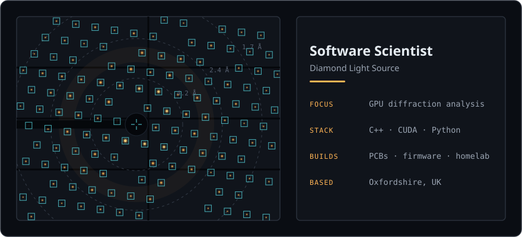

Software Scientist at [Diamond Light Source](https://www.diamond.ac.uk/),
the UK's national synchrotron. I develop GPU-accelerated analysis
algorithms in CUDA for x-ray diffraction data.

At heart I am a scientist and developer who never quite chose between
writing software and picking up a soldering iron, so I happily do both.
The hardware half fills my evenings and weekends: PCBs I design myself
and then fuss over, embedded firmware for microcontrollers and FPGAs, a
3D printer, and a little homelab I am rather too fond of.

### What I work on

| | |
|---|---|
| [**fast-feedback-service**](https://github.com/DiamondLightSource/fast-feedback-service) | GPU spotfinding and integration for live feedback during beamline experiments ([my merged PRs](https://github.com/DiamondLightSource/fast-feedback-service/pulls?q=is%3Apr+is%3Amerged+author%3Adimitrivlachos)) |
| [**dx2**](https://github.com/dials/dx2) | Standalone C++ models for diffraction experiment data ([my merged PRs](https://github.com/dials/dx2/pulls?q=is%3Apr+is%3Amerged+author%3Adimitrivlachos)) |
| [**DIALS**](https://dials.github.io/) | The diffraction analysis toolkit this all connects to ([my contributions](https://github.com/dials/dials/pulls?q=is%3Apr+author%3Adimitrivlachos)) |

### Find me

